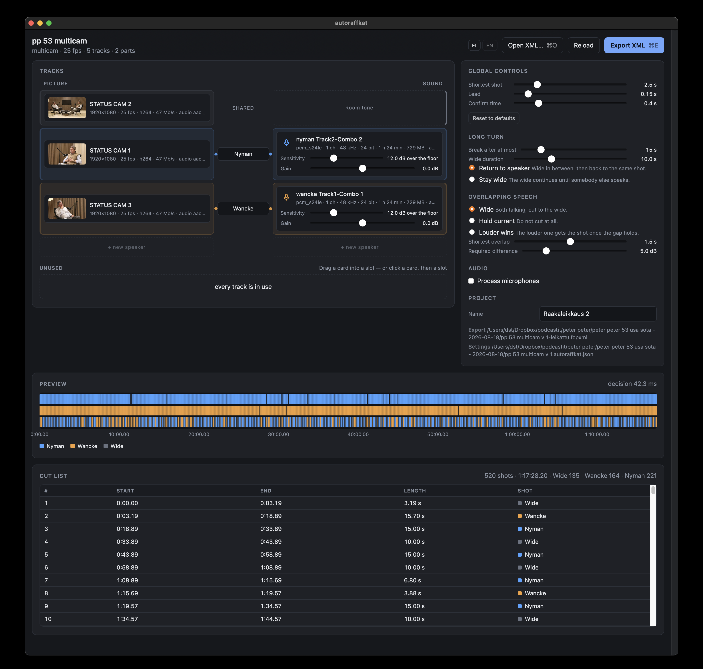
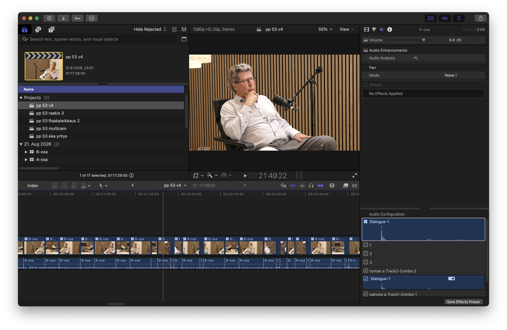

# autoraffkat

*[English README](README.md) · [Suunnittelumuistiinpanot](DESIGN.fi.md)*

> Tämä on suomenkielinen versio. Ensisijainen dokumentaatio on
> [`README.md`](README.md), ja se päivittyy ensin.

Automaattinen monikameraleikkaus. Final Cutista viety FCPXML sisään, uusi
FCPXML ulos, jossa kuva vaihtuu sen mukaan kuka puhuu. Ei renderöintiä
missään vaiheessa.



*Yksi rivi per puhuja: kamera, nimi ja mikki. Palkki alla on koko jakso
yhdellä silmäyksellä, ja sen alla oleva lista on jokainen leikkaus jonka
vienti tekee. Kuvassa leikataan historiaohjelma
[Peter & Peterin](https://www.youtube.com/@peterpeterhistoria) jaksoa 53.*



*Lopputulos tuotuna Final Cut Prohon: tavallinen monikameran aikajana, jossa
kulmat, leikkaukset ja dialogiroolit ovat valmiina jatkoeditointia varten.*

* **Kuva vaihtuu äänestä**, ei rytmistä: kunkin puhujan mikki päättää milloin
  hänen kameransa on ruudulla.
* **Pitkä puheenvuoro ja päällekkäispuhe ovat sääntöjä**, jotka asetetaan
  kerran — laajaan, nykyiseen kuvaan tai kovempaan mikkiin.
* **Millisekunteja per säätö.** Liukusäätimen liike päättää koko jakson
  uudestaan ja piirtää esikatselun ilman että mitään kirjoitetaan levylle.
* **Final Cut Prosta ulos ja takaisin.** Monikameralähteestä tulee
  monikameraleikkaus; kulmat, roolit ja synkka säilyvät.

## Käyttö

```
uv run autoraffkat
```

Ilman argumenttia lähde etsitään työhakemistosta: ainoa vienti avataan
suoraan, useammasta kysytään numeroitu valinta (Enter = uusin), ja tyhjästä
hakemistosta avautuu Finderin valintaikkuna. Polun voi silti antaa, ja
`.fcpxmld`-paketin voi antaa sellaisenaan:

```
uv run autoraffkat "episode 12.fcpxmld"
uv run autoraffkat --pick            # suoraan valintaikkuna
```

Valmiit `-cut`-viennit eivät päädy tarjolle: silmukassa palataan aina
alkuperäiseen lähteeseen.

Selain avautuu osoitteeseen `http://127.0.0.1:8731/`.

Silmukka:

1. Synkkaa kuvat ja äänet Final Cutissa, vie XML.
2. Avaa XML sovelluksessa, nimeä raidat, säädä liukusäätimiä.
3. Vie XML (`⌘E`), tuo Final Cutiin, katso.
4. Jos ei kelpaa, takaisin kohtaan 2.

Kohdan 2 ja 3 välissä kuluu millisekunteja: liukusäätimen liike ajaa vain
päätöskerroksen, ja esikatselupalkki näyttää lopputuloksen ilman XML-kierrosta.

Vienti kirjoittaa uuden tiedoston `jakso-cut broadcast.fcpxml`; lähde-XML:ää
ei kosketa. Asetukset tallentuvat tiedostoon `jakso.autoraffkat.json` XML:n
viereen.

Nimi kertoo millä säätimillä leikkaus tehtiin: rytmiprofiili aina, ja lisäksi
ne säätimet jotka poikkeavat oletuksesta (`jakso-cut custom 3s louder stay
audio.fcpxml`). Final Cutin selaimessa nimi on ainoa mikä erottaa leikkaukset
toisistaan, eivätkä `-cut` ja `-cut v2` kerro kumpi niistä oli se nopea.
Tunnisteet saa pois valinnalla **Säätimet tiedostonimeen** Projekti-osiosta;
käyttöliittymässä näkyvä polku seuraa säätimiä, joten valinnan vaikutuksen
näkee ennen vientiä.

Aiemman viennin päälle ei kirjoiteta. Jos `jakso-cut broadcast.fcpxml` on jo
olemassa, seuraavasta tulee `jakso-cut broadcast v2.fcpxml`, sitten `v3` ja
niin edelleen. Numero juoksee saman asetusjoukon sisällä: eri säätimillä tehty
leikkaus on eri tiedosto eikä saman tiedoston seuraava versio.

Säätimet kulkevat myös viedyn XML:n sisällä. Sekvenssissä on yhden rivin
`<note>` — versio, rytmi, kuvien kestot, säännöt ja se käsiteltiinkö mikit —
ja `<metadata>`-lohko, jossa on oma `<md>` jokaiselle säätimelle sekä koko
asetusjoukko JSONina avaimella `fi.autoraffkat.settings`. Sen ansiosta
leikkauksen voi toistaa pelkän tiedoston perusteella koneella, joka ei ole
nähnyt asetustiedostoa.

Kun lähde on `.fcpxmld`-paketti, kumpikaan tiedosto ei mene paketin sisään
vaan sen viereen ja saa paketin nimen: `episode 12.fcpxmld` tuottaa
`episode 12-cut broadcast.fcpxml` ja `episode 12.autoraffkat.json`.
Paketti kuuluu Final Cutille.

Uusi jakso perii roolit edellisestä: raita-avaimet on johdettu
tiedostonimistä, joten `CAM 1` on sama kamera myös ensi viikolla.
Perintä haetaan XML:n hakemistosta, sen yläpuolelta ja yläpuolen
`.fcpxmld`-paketeista, ja lähde näkyy otsikon alla rivillä «Roolit peritty».
Jakson omat asetukset ohittavat perinnän aina.

### Lataus

[Releasesissa](../../releases) on levykuva Apple Siliconille. CI kääntää ja
julkaisee sen `v*`-tagista. Se ei ole notarisoitu — siihen tarvittaisiin
maksullinen Apple Developer ID — joten ensimmäisellä avauksella tarvitaan oikea
klikkaus paketin päällä ja «Avaa», tai `xattr -d com.apple.quarantine
autoraffkat.app`.

Paketissa kaikki on arm64:ää, myös ffmpeg, joten Rosettaa ei tarvita.
Intel-Macille tarvitaan oma paketti: GitHubilla ei ole enää ilmaisia
Intel-ajureita, joten se käännetään Intel-koneella komennolla
`scripts/build_app.py --dmg`, joka hakee itse oikean arkkitehtuurin binäärit.

### Asennus lähteestä

```
brew install ffmpeg
uv sync            # tai: pip install -e .
```

### Työpöytäsovellus

```
uv run python scripts/build_app.py          # dist/autoraffkat.app
uv run python scripts/build_app.py --dmg    # …ja dist/autoraffkat.dmg
```

`v*`-tagin puskeminen ajaa samat kaksi komentoa CI:llä ja julkaisee
levykuvan Releasesiin; katso `.github/workflows/build.yml`.

Käännös niputtaa mukaan staattiset ffmpeg- ja ffprobe-binäärit ja hakee ne
`bin/`-hakemistoon ensimmäisellä kerralla
[ffmpeg-staticista](https://github.com/eugeneware/ffmpeg-static) naulattuna
versiona tarkistussummineen. Haku kohdistuu siihen arkkitehtuuriin jolla
ajetaan, ja väärän arkkitehtuurin binääri korvataan: se toimisi
kääntäjän koneella ja hajoaisi käyttäjän koneella. `scripts/make_dmg.py` pakkaa jo
käännetyn paketin erikseen. Se kopioi `ditto`lla eikä tavallisella
tiedostokopiolla: allekirjoitus kattaa myös laajennetut attribuutit ja
symlinkit, ja tavallinen kopio rikkoo sen niin että vika näkyy vasta toisen
käyttäjän koneella.

## Sisäänluku

Tuetaan kolmea lähdettä:

* **synkronoitu klippi** (`sync-clip`), jonka sisällä kamerat ja mikit ovat
omilla laneillaan
* **projektin aikajana** (`project` > `sequence` > `spine`), jossa kamerat ja
mikit on aseteltu käsin
* **monikameraklippi** (`mc-clip`), jonka kamerat ja mikit ovat kulmina

Synkkaus luetaan XML:stä, ei lasketa. Ruutunopeus otetaan sekvenssin tai
video-assetin formaatista.

### Monikamera ja osat

Pitkä nauhoitus on tavallisesti spinellä useampana monikameraklippinä — osa A,
osa B — ja jokaisessa osassa sama kamera on oma tiedostonsa. Kolme kameraa
kahdessa osassa on kuusi tiedostoa mutta kolme **raitaa**: roolit, säätimet ja
leikkaus kulkevat raidoittain, ja raita kootaan kulman nimen perusteella.

Raidan avain johdetaan tiedostonimien yhteisestä osasta
(`CAM 1 01` + `CAM 1 02` → `CAM 1`), koska kulmien nimet
ja `angleID`:t vaihtuvat viennistä toiseen mutta tiedostot eivät. Näin
tallennetut roolit kelpaavat vielä uuden viennin jälkeenkin.

### Etäpalvelinkäyttö

autoraffkatia voi ajaa etäkoneella (esim. nopeammalla Macilla tai työasemalla), jolloin raskas äänenkäsittely ja verhokäyrien purku tapahtuvat etänä:

```
uv run autoraffkat --host 0.0.0.0 --port 8731 --no-gui --no-browser "jakso 12.fcpxmld"
```

Avaa selaimessa `http://<etä-ip>:8731/`. XML:n viittaamien mediatiedostojen tulee olla etäkoneen luettavissa (esim. 10GbE-verkkolevyllä tai synkronoidussa hakemistossa).

### Liitännäisten hakupolut

Ulkoiset VST3- ja AU-liitännäiset etsitään automaattisesti käyttöjärjestelmän vakiopaikoista:
* **macOS:** `/Library/Audio/Plug-Ins/VST3`, `~/Library/Audio/Plug-Ins/VST3`, `/Library/Audio/Plug-Ins/Components`, `~/Library/Audio/Plug-Ins/Components`
* **Linux:** `/usr/lib/vst3`, `/usr/local/lib/vst3`, `~/.vst3`, `~/.local/lib/vst3`
* **Windows:** `%CommonProgramFiles%\VST3`, `%LOCALAPPDATA%\Programs\Common\VST3`

Kun liitännäinen on valittu, sen omat säätimet ilmestyvät kentän alle — samat
parametrit jotka liitännäinen tarjoaa isäntäohjelmalle, liitännäisen omissa
yksiköissä (dB, %, päällä/pois). Asetuksiin tallentuvat vain ne säätimet joita
on liikutettu, muut jäävät liitännäisen omiin oletuksiin. **Liitännäisen
oletukset** nollaa ne kaikki. Säätimet kuuluvat siihen liitännäiseen josta ne
luettiin: toisen liitännäisen valinta nollaa ne, koska sama nimi toisessa
liitännäisessä osuisi väärään säätimeen.

## Säätimet

**Rytmi ja profiili**: Valitse valmis leikkaustyyli tai säädä käsin:
* **Tv ja podcast** (oletus): 2,5 s minimikuva, 300 ms J-cut-ennakko, 600 ms L-cut-häntä, 14 s monologikatkaisu. Luonteva keskustelurytmi.
* **Rauhallinen**: 4,5 s minimikuva, 150 ms ennakko, 1000 ms häntä, 22 s monologikatkaisu. Viipyilevä dokumentaarinen rytmi.
* **Korkeatempoinen**: 1,4 s minimikuva, 400 ms ennakko, 250 ms häntä, 8 s monologikatkaisu. Nopea viihde- ja väittelyrytmi.
* **Mukautettu**: Käsin säädetyt parametrit.

**Raitakohtaiset** (mikeille): herkkyys eli montako desibeliä pohjakohinan yli
puheeksi lasketaan, ja vahvistuksen korjaus. Herkkyys on kynnys pohjan
suhteen, joten se ei siirry vahvistuksen mukana; vahvistus vaikuttaa vain
mikkien keskinäiseen vertailuun päällekkäispuheessa.

**Globaalit ja leikkausrytmi**:
* **Lyhin kuvan kesto**: kuinka kauan kamera pysyy ruudussa vähintään.
* **Ennakko (J-cut)**: leikkaa tulevaan puhujaan ennen äänen kynnyksen ylitystä, jolloin sisäänhengitys ja ilmeet tulevat mukaan.
* **Häntä (L-cut)**: pitää edellisen puhujan ruudussa puheen päätyttyä, antaen keskustelun tauoille tilaa.
* **Vahvistusaika**: puheen on jatkuttava näin kauan ennen leikkauspäätöstä.
* **1/f-tempo-ohjaus**: päätöskerros seuraa puheen tiheyttä liukuvassa 45 s ikkunassa ja mukauttaa leikkausaikoja dynaamisesti (tiheä dialogi leikkaa nopeammin, rauhallinen hitaammin).

**Pitkä puheenvuoro**: yksi lähikuva ei kanna loputtomiin. Kun sama puhuja on
pitänyt lattiaa asetetun ajan (oletus 14 s), kuva katkeaa luonnolliseen hengähdykseen tai taukoon. Kolme tapaa jatkaa:

* **Palaa puhujaan** — laaja kestää «Laajan kesto» ja palataan samaan
kuvaan. Monologi hengittää, rytmi pysyy puhujassa.
* **Jää laajaan** — laaja jatkuu, kunnes joku toinen saa puheenvuoron.
Vähemmän leikkauksia, ja pitkä yksinpuhelu näyttää tilanteelta.
* **Reaktiokuva** — leikkaa toisen puhujan lähikuvaan «Laajan kesto» ajaksi, sitten takaisin. (Jos toista lähikuvaa ei ole, palaa laajaan).

Nolla poistaa säännön käytöstä. Laaja ei koskaan jää alle lyhimmän kuvan
keston, vaikka «Laajan kesto» olisi pienempi.

**Päällekkäispuhe**, kolme sääntöä:

* *Laaja* — molemmat äänessä, mennään laajaan
* *Pidä nykyinen* — ei leikata mihinkään
* *Vahvempi voittaa* — kovempi saa kuvan, kun ero ylittää `dominance`-rajan

Kaikkia kolmea koskee lyhin päällekkäispuheen kesto: ohikiitävä myötäily ei
laukaise sääntöä.

## Säätäminen

| Oire | Korjaus |
|---|---|
| Kuvat vaihtuvat liian usein | Nosta **lyhintä kuvan kestoa**. Jos ei riitä, nosta **vahvistusaikaa**: lyhyet äännähdykset eivät enää lasketa puheeksi. |
| Kuva vaihtuu myöhässä | Nosta **ennakkoa**. Puoli sekuntia on yleensä liikaa, 0,1–0,3 s riittää. |
| Väärä kamera hiljaisissa kohdissa | Mikki kuulee toisen puhujan vuotona. Nosta sen mikin **herkkyyttä**. |
| Toinen puhuja voittaa aina päällekkäispuheessa | Mikit ovat eri äänekkäitä. Nosta hiljaisemman **vahvistusta**. Se vaikuttaa vain mikkien keskinäiseen vertailuun, ei kynnykseen. |
| Laajaan mennään liian herkästi | Nosta **lyhintä päällekkäisyyttä**, jolloin myötäily ei laukaise sääntöä. |

## Rakenne

```
src/autoraffkat/
  timeline.py        FCPXML:n rationaaliaika (Fraction)
  model.py           mediat, roolit, asetukset, leikkaukset
  fcpxml/read.py     sync-clip, spine ja monikamera sisään
  fcpxml/write.py    uusi projekti ulos, littana tai monikamerana
  audio/envelope.py  ffmpeg + RMS, levyvälimuisti          HIDAS
  audio/chain.py     kanavanauha: pedalboard + liitännäiset
  audio/mix.py       mitkä tiedostot, minne, synkan vahti     HIDAS
  analysis.py        verhokäyrät aikajanan ruudukolle
  decide.py          kynnykset, kestot, päällekkäispuhe    NOPEA
  preview.py         palkin tiivistys selaimelle
  project.py         asetukset JSONina XML:n viereen
  i18n.py            palvelimen viestit kahdella kielellä
  probe.py           tiedostojen tekniset tiedot ffprobella
  thumbs.py          ruutu kameratiedoston puolivälistä
  pick.py            lähteen etsintä ja valinta käynnistyksessä
  server/app.py      HTTP-rajapinta
  server/static/     käyttöliittymä (i18n.js = selaimen tekstit)
```

Yksityiskohtainen perustelu: [`DESIGN.fi.md`](DESIGN.fi.md).

Lyhyesti: analyysi on kahdessa kerroksessa. Verhokäyrä (ffmpeg, sekunteja
minuuttia kohden) ajetaan kerran tiedostoa kohden ja välimuistitetaan
`~/Library/Caches/autoraffkat/`. Päätös (numpy, 11–38 ms kahden tunnin
aineistolla) ajetaan uudestaan joka säädöllä. Ilman tätä jakoa käyttöliittymä
olisi käyttökelvoton.

Käyttöliittymä on Python ja paikallinen web, ei SwiftUI: analyysikoodi on jo
Pythonia, eikä myöhempi videotoisto vaadi päätöskerrokseen muutoksia.

## HTTP-rajapinta

Käyttöliittymä käyttää näitä; samat kelpaavat skriptaukseen.

| | |
|---|---|
| `GET /api/state` | mediat, roolit, säätimet, verhokäyrien edistyminen |
| `POST /api/settings` | säätimet sisään, leikkauslista ja esikatselu ulos |
| `POST /api/export` | kirjoittaa leikatun XML:n, palauttaa polun |
| `POST /api/reload` | lukee lähde-XML:n uudestaan levyltä |
| `POST /api/open` | vaihtaa toiseen XML:ään polun perusteella |
| `POST /api/pick` | avaa Finderin valintaikkunan ja palauttaa polun |

```
curl -s -X POST localhost:8731/api/export \
     -H 'Content-Type: application/json' -d @asetukset.json
```

`POST /api/settings` palauttaa `ok: false` ja luettavan `problems`-listan, kun
roolit ovat kesken. Se on normaali välitila, ei virhe.

## Kun jokin ei toimi

| Viesti tai oire | Syy |
|---|---|
| `ffmpeg puuttuu polusta` | `brew install ffmpeg` |
| `Tiedostoa ei löydy levyltä` raitalistassa | XML viittaa polkuun jota ei ole: materiaali on siirtynyt viennin jälkeen tai vienti osoittaa proxyihin. Yhdistä media Final Cutissa ja vie uudestaan. |
| `XML:stä ei löytynyt projektia eikä synkronoitua klippiä` | Viety on esimerkiksi pelkkä event. Valitse synkattu klippi tai projekti ennen vientiä. |
| `Laajalla kuvalla ja mikeillä ei ole yhteistä aikaa` | Roolitus osoittaa medioihin jotka eivät ole päällekkäin aikajanalla. |
| Palkki näyttää oikealta, Final Cut ei | Tarkista sekvenssin ruutunopeus. Se luetaan XML:stä, joten väärä arvo on lähteessä. |
| Verhokäyrät lasketaan aina uudestaan | Välimuistin avaimessa on muokkausaika. Verkkolevy joka muuttaa aikaleimoja ei osu välimuistiin. |

## Ulostulo

Yksi leikkausraita spinellä. Kameroiden oma ääni pois (`srcEnable="video"`),
mikit yhtenäisinä liitettyinä klippeinä laneilla -1, -2, … omilla
`dialogue.<puhuja>`-rooleillaan. Leikkauskohdat kvantisoidaan kehyksiin niin,
ettei aikajanalle jää aukkoja eikä päällekkäisyyksiä. Kaikki aika kulkee
`Fraction`ina, koska liukulukujen pyöristysvirhe kertyy tuhansien kehysten yli.

## Ääni

Käsittelemätön mikki on tyypillisesti −40 LUFS, eikä sitä kannata viedä
sellaisenaan. Painike «Käsittele ääni» ajaa mikit kanavanauhan läpi:

1. **Ulkoinen liitännäinen** (VST3 tai AU) ensin — tässä tehdään kohinanpoisto
   ja restaurointi
2. **Ylipäästö** vie jyrinän
3. **Maiskausten poisto** siivoaa huulinaksut
4. **Normalisointi** tavoiteäänekkyyteen, mitattuna vasta siivotusta signaalista
5. **Kompressointi** kahdessa vaiheessa, nopea ja hidas
6. **Tason korjaus ja huippukatto**

Normalisointi on vasta neljäntenä tarkoituksella: kompressorin kynnykset ovat
absoluuttisia desibelejä, eikä −12 dB:n kynnys ylity kertaakaan jos raita on
−40 LUFS. Taso mitataan vielä kompressoinnin jälkeen uudestaan, koska LUFS
portittaa hiljaiset kohdat suhteessa kokonaisuuteen ja kompressointi siirtää
lukemaa.

**Ketjussa ei ole kohinanvaimennusta.** Ylipäästö vie jyrinän ja maiskausten
poisto huulinaksut, mutta laajakaistaista kohinaa ei vaimenneta. Se on
liitännäisen työtä — hyvä puheen restaurointi (esim. dxRevive) tekee sen
paremmin kuin mikään mitä tähän kannattaisi kirjoittaa.

Huomaa että normalisointi nostaa myös pohjakohinaa. Tyypillinen nosto on
+20…+26 dB, ja käyttöliittymä näyttää toteutuneen luvun.

Kaksi sääntöä pitävät kuvan ja äänen yhdessä:

* **Alkuperäiseen ei kosketa.** Käsitelty ääni menee viereen nimellä
`mikki [mix].wav`, ja vienti viittaa siihen.
* **Näytemäärä ei muutu eikä ääni siirry.** Pituus tarkistetaan kahdesti ja
siirtymä mitataan ristikorrelaatiolla — liitännäinen voi ilmoittaa viiveensä
väärin ja tuottaa oikean mittaisen mutta väärässä kohdassa olevan raidan.
Poikkeava hylätään.

Analyysi ajetaan aina raa'asta äänestä, koska kompressori nostaa pohjakohinaa
ja tasoittaa mikkien eron — juuri ne kaksi asiaa, joihin herkkyys ja
päällekkäispuheen sääntö nojaavat.

**Tilaääni**: yksi kameraraita voidaan purkaa omaksi ääniraidakseen ja liittää
leikkaukseen roolilla `effects.Tilaääni` asetetun verran puhetta hiljemmalle.
Se ei ole kulma vaan liitetty klippi, joten se jatkuu leikkausten yli.
Kompressointia siihen ei tehdä: kompressoitu tilaääni pumppaa.

### Toisen mikin vaimennus

Valinnainen. Kun toinen puhuu, toisen mikki vaimennetaan — oletuksena 9 dB,
ei kokonaan mykistetä.

Oletus on tahallisen matala. Vuoto on mitatusti noin 13 dB puheen alla, joten
sitä syvempi vaimennus muuttaa yhteissummaa alle 0,1 dB: −9 dB ja −15 dB
eroavat toisistaan keskimäärin 34 dB miksin alapuolella. Hyöty tulee siis
ajoituksesta eikä syvyydestä, ja matala vaimennus tekee vähemmän vahinkoa jos
tunnistus erehtyy. Syvempää kannattaa kokeilla vain jos mikit ovat lähekkäin
tai huone on eläväinen.

Ohjaus tulee **samasta puheentunnistuksesta kuin kuvan leikkaus**, eli siitä
mikä näkyy esikatselupalkissa ja on jo säädetty herkkyyssäätimillä. Se on koko
idea: portin vaikea osa on tunnistus, ja se on jo tehty ja katsottu.

Kynnys yksin ei riitä. Kaksi mikkiä samassa huoneessa kuulevat molemmat
puhujat, joten kumpikin ylittää kynnyksen lähes aina — mitatussa jaksossa
41 % ajasta yhtä aikaa. Siksi auki jää vain **kovin** mikki ja ne jotka ovat
«erotus kovimpaan» -säätimen sisällä siitä. Vuoto on mitatusti 12,8 dB
hiljempaa kuin lähin mikki, joten kuuden desibelin ikkunalla molemmat jäävät
auki enää 6 % ajasta — ja se on aitoa päällekkäispuhetta.

**Vaimennus tapahtuu vain toisen puheen alla.** Jos kukaan ei puhu, kaikki
mikit jäävät auki. Hiljaisuuteen laskeva portti kuuluu aina, koska mikään ei
peitä sitä; toisen puhujan aloituksen alla lasku katoaa kuulumattomiin. Siksi
lasku ajoitetaan toisen puheen alkuun **ilman ennakkoa**, ja paluu ehtii
loppuun ennen kuin peittävä ääni loppuu. Liu'ut ovat hitaita — 0,25 s alas ja
0,4 s ylös — koska ne ovat piilossa eikä niiden tarvitse olla nopeita.

Aikasäätimet tekevät portista käyttökelpoisen:

* **Lyhin avaus** pudottaa liian lyhyet jaksot: yskäisy ei avaa mikkiä.
* **Ennakko** avaa portin ennen puheen alkua. Tämä onnistuu vain koska
käsittely on jälkikäteistä — reaaliaikainen portti ei voi avautua ennen kuin
ääni on jo tullut, ja siksi siltä katoaa sanojen alkuja.
* **Pito** pitää portin auki puheen jälkeen, jolloin lauseen häntä ja hengitys
jäävät mukaan.
* **Lyhin vaimennus** estää alle puolen sekunnin kuopat: ne kuuluvat
naksahduksena eivätkä vaimennuksena.

Vaimennus tehdään viimeisenä, jotta mitattu taso koskee puhetta eikä puheen ja
hiljaisuuden keskiarvoa.

### Järjestys: käsittele, vie, leikkaa

Tässä järjestyksessä ja tästä syystä:

**Mikkiääni ei voi irrota synkasta Final Cutissa.** Se menee vientiin
monikameraklipin sisään (`mc-source srcEnable="audio"`), joten kuva ja ääni
liikkuvat yhdessä riippumatta siitä miten leikkaat.

**Tilaääni voi irrota.** Se on liitetty klippi lanella −1, koska `mc-source`
ei tunne tasoa. Jos poistat aikajanalta jakson ja suljet aukon, tarina
lyhenee mutta liitetty klippi ei — tilaääni siirtyy poistetun verran. Katkaise
tilaääni samasta kohdasta, tai jätä se pois jos aiot leikata paljon.

**Vienti kesken käsittelyn on ehjä mutta käsittelemätön.** Tiedostot
kirjoitetaan väliaikaisen kautta, joten puolikasta ei näy koskaan — mutta
vienti viittaa vain valmiisiin, eli keskeneräiset jäävät raa'aksi ääneksi.
Siitä tulee varoitus vientipainikkeen jälkeen.

**Uusi vienti ei tuo Final Cutissa tehtyjä muokkauksia mukanaan.** Se on uusi
projekti. Siksi käsittely kannattaa ajaa loppuun ennen kuin viet ja alat
leikata.

## Kieli

Käyttöliittymä on suomeksi ja englanniksi; valitsin on otsikkorivillä.
Oletuskieli tulee järjestelmästä (`AUTORAFFKAT_LANG`, `LANG`), ja valinta
tallentuu asetuksiin ja periytyy jaksosta toiseen kuten muutkin asetukset.

Myös palvelimen viestit käännetään: englanninkielisessä käyttöliittymässä ei
näy suomenkielisiä virheilmoituksia. Selaimen tekstit ovat
`server/static/i18n.js`:ssä ja palvelimen `i18n.py`:ssä.

Koodi, kommentit ja docstringit ovat suomeksi. Ne ovat tekijöille, eivät
käyttäjälle.

## Raitalista

Raitalista on kytkentätaulu. Yksi rivi on yksi puhuja: kamera vasemmalla, mikki
oikealla ja nimi kerran niiden välissä. Kun molemmat päät ovat paikallaan,
väliin piirtyy piuha; jos toinen puuttuu, väliin jää aukko.

Roolitus tehdään kortteja siirtämällä, ei valikoista valitsemalla. Vedä kortti
paikkaansa — tai klikkaa ensin korttia ja sitten paikkaa, mikä tekee saman ja
toimii myös näppäimistöltä. Paikka kertoo mikä kortista tulee: kamera puhujan
paikassa on hänen lähikuvansa ja äänitiedosto hänen mikkinsä. Ylin rivi on
niille raidoille jotka kuuluvat kaikille, eli laajalle kuvalle ja tilaäänelle.
Sijoittamattomat raidat odottavat taulun alla **Käyttämättömissä**, ja kortin
vetäminen sinne ottaa sen pois leikkauksesta.

Nimi kirjoitetaan kerran riville, joten lähikuva ja mikki eivät voi erkaantua
kirjoitusvirheen takia. Pudota kortti kohtaan **+ uusi puhuja**, niin uusi rivi
syntyy nimettynä ja valmiina nimettäväksi uudelleen.

Kuvakortit näyttävät ruudun tiedoston puolivälistä. Monikamerassa kulmat ovat
`1`, `2` ja `3` eikä tiedostonimikään kerro kumpaa puhujaa kamera kuvaa, joten
ilman kuvaa roolitus on arvailua. Ruutu puretaan vasta kun sitä pyydetään ja
jää välimuistiin.

Kortissa lukee mitä tiedosto on: mitat, ruutunopeus, koodekki ja bittinopeus
kuvalle, kanavat, näytetaajuus ja bittisyvyys äänelle, sekä yhteiskesto ja
-koko kaikista osista. Mikkikortissa ovat sen omat herkkyys ja vahvistus.

## Säätimet ja oletukset

Jokainen arvo on säädettävissä ja jokaisella on oletus, joka toimii ilman
säätämistä. Oletukset on valittu oikealla aineistolla mitaten, eivät
arvaamalla — perustelut ovat [`DESIGN.fi.md`](DESIGN.fi.md):ssä.

Kovakoodattuna on vain kanavanauhan sisäinen dynamiikka: kompressorien suhteet
ja ajat sekä huippukatto. Niiden kynnykset ovat säätimiä, ja kynnys on se joka
aineiston mukana muuttuu.

«Palauta oletukset» kummassakin ryhmässä palauttaa tehdasarvot. Sitä tarvitaan,
koska asetukset periytyvät seuraavaan jaksoon: ilman paluuta yksi huono arvo
kulkisi mukana loputtomiin. Roolit, puhujat ja projektin nimi jäävät — ne ovat
työtä, eivät säätöä.

## Rajaukset

Videon toisto ja aaltomuodon piirto eivät kuulu tähän versioon.

Monikameralähteestä ulos tulee monikameraleikkaus, tavallisesta lähteestä
littana leikkaus. Kummankin muodon valinta tapahtuu lähteen mukaan, eikä
kesken leikkauksen voi vaihtaa.

## Testit

```
uv run pytest
```

Vienti tarkistetaan Final Cutin omaa DTD:tä vasten, jos Final Cut on
asennettuna — oma lukija hyväksyy enemmän kuin tuonti.

Testiaineisto syntetisoidaan ffmpegillä: siniaaltopurskeita tunnetuissa
kohdissa, joten päätöksen oikeellisuus on tarkistettavissa ilman oikeaa
kuvausmateriaalia (`tests/make_fixture.py`).

## Lisenssi

MIT — katso [`LICENSE`](LICENSE).
